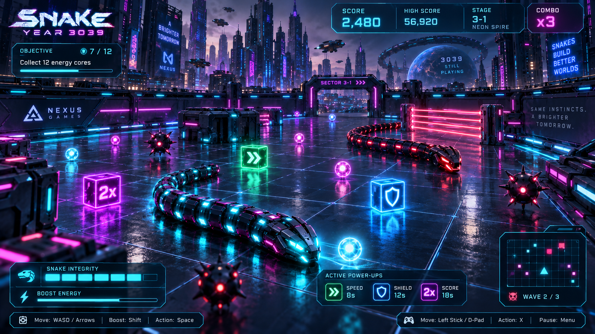
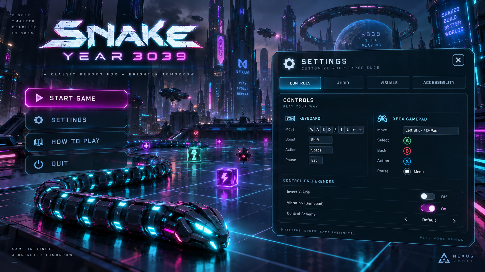

# SNAKE: YEAR 3039

**FULL GAME • PRODUCT REQUIREMENTS & BUILDER HANDOFF**

A cyberpunk arcade-survival game for the browser.

*Approved gameplay concept. Art-direction target, not a screenshot of an implemented game.*

> Collect energy. Outsmart the system. Turn your own path into a weapon.

Prepared for J Rhythm | Version 2.0 | September 5, 2026

Complete launch vision: five districts, fifteen campaign waves, five boss encounters, rival serpents, eight pickups, four play modes, cosmetic progression, and production-quality presentation.

This specification supersedes the version 1.0 release boundaries. Implementation can be staged. The intended release is the full game, not the first development milestone.

---

## Document map & authority

**One coherent destination. Iterative construction, not a reduced product.**

Read the full PRD before estimating or building. Use the linked chapter headings in this document and the matching Markdown source in the builder package. Each chapter defines part of the same launch release.

[01 / The full-game mandate](#01-the-full-game-mandate)  
[02 / World, fantasy & opening](#02-world-fantasy-opening)  
[03 / Approved Start & Settings reference](#03-approved-start-settings-reference)  
[04 / Approved gameplay reference](#04-approved-gameplay-reference)  
[05 / Full launch inventory & modes](#05-full-launch-inventory-modes)  
[06 / Campaign flow & checkpoints](#06-campaign-flow-checkpoints)  
[07 / District design catalog](#07-district-design-catalog)  
[08 / Campaign encounter schedule](#08-campaign-encounter-schedule)  
[09 / Movement, body & boost](#09-movement-body-boost)  
[10 / Keyboard & Xbox controls](#10-keyboard-xbox-controls)  
[11 / Camera & gameplay HUD](#11-camera-gameplay-hud)  
[12 / Collision, integrity & fairness](#12-collision-integrity-fairness)  
[13 / Eight launch pickups](#13-eight-launch-pickups)  
[14 / Tactical abilities & spawn economy](#14-tactical-abilities-spawn-economy)  
[15 / Score, combo & local records](#15-score-combo-local-records)  
[16 / Enemies & environmental threats](#16-enemies-environmental-threats)  
[17 / Rival-serpent combat](#17-rival-serpent-combat)  
[18 / Boss finales: districts 1–3](#18-boss-finales-districts-1-3)  
[19 / Boss finales: districts 4–5](#19-boss-finales-districts-4-5)  
[20 / Arcade Run & Endless](#20-arcade-run-endless)  
[21 / Twelve authored Trials](#21-twelve-authored-trials)  
[22 / Progression, Workshop & rewards](#22-progression-workshop-rewards)  
[23 / Screens, state flow & onboarding](#23-screens-state-flow-onboarding)  
[24 / Settings, difficulty & accessibility](#24-settings-difficulty-accessibility)  
[25 / Visual direction & asset production](#25-visual-direction-asset-production)  
[26 / Music, sound & game feel](#26-music-sound-game-feel)  
[27 / Browser implementation architecture](#27-browser-implementation-architecture)  
[28 / Data, saves & content validation](#28-data-saves-content-validation)  
[29 / Performance & compatibility targets](#29-performance-compatibility-targets)  
[30 / Delivery plan: polish established early](#30-delivery-plan-polish-established-early)  
[31 / Functional launch acceptance](#31-functional-launch-acceptance)  
[32 / Experience, visual & release acceptance](#32-experience-visual-release-acceptance)  
[33 / Tuning, risks & change control](#33-tuning-risks-change-control)  
[34 / Sources, provenance & package](#34-sources-provenance-package)  

### What is settled and what can evolve

Owner-directed baseline: the title, browser-based 3D experience, cyberpunk references, smooth arena movement, keyboard/Xbox support, and a full-game handoff rather than an MVP. These are not optional placeholders.

Authored design defaults: district names, story, content counts, new abilities, boss patterns, progression thresholds, and numeric balance are proposed here to make the full game buildable. They are the working specification, not claims that J Rhythm separately approved every detail.

Exact tooling, asset sources, benchmark hardware, and tuning can change through documented review. New implementation choices must preserve the player-facing intent. Nothing in this package establishes that a game, production asset, benchmark, or controller test already exists.

---

## 01 / The full-game mandate

**A complete game with a recognizable identity from the first presentable build.**

### Product promise

Snake: Year 3039 combines the clarity of classic Snake with the presence of a modern cyberpunk arcade game. The player pilots S-39, an armored autonomous serpent, through a city-sized security network. Energy makes the body longer. A longer body creates danger, but also gives the player a powerful way to control enemy movement.

The goal is not merely to prove that a snake can move in a browser. The goal is a game people want to keep playing: strong controls, memorable environments, clever enemies, rewarding mastery, excellent sound, and a compelling start-to-finish experience.

| Pillar | Player-facing requirement |
| --- | --- |
| Immediate presence | A dimensional armored snake, atmospheric city, responsive menus, and a distinctive musical identity appear in the first presentable build. |
| Movement is the combat | Steer, boost, route, bait, and outmaneuver. No required aiming or shooting system replaces the snake mechanic. |
| Readable spectacle | Beautiful materials and lighting support legible paths, warnings, pickups, and collision silhouettes. |
| A complete journey | The launch release includes every district, its finale, the campaign ending, replay modes, and progression. |
| One game, two equal inputs | Keyboard and Xbox gamepad cover gameplay, menus, setup, restart, and progression without required mouse use. |

### Explicit correction to version 1.0

Rival serpents, additional arenas, bosses, replay modes, cosmetic progression, and the audiovisual finish are launch requirements. A single three-wave arena is a development deliverable, not the release definition. The former “later expansion” classification does not carry forward.

> No silent scope reduction. If a feature proves expensive or difficult, present alternatives that preserve its purpose. Do not remove it, replace it with a mock screen, or relabel a partial implementation as the full game.

---

## 02 / World, fantasy & opening

**Same instinct. A world worth mastering.**

### Working fiction

In 3039, the city runs on a closed energy network controlled by an automated authority called the Custodian. S-39 was built to maintain its conduits. An unexpected awakening turns routine collection into an act of independence: recover the city’s energy, sever control relays, and reopen five districts.

Story is environmental and concise. A short opening, district introductions, boss warnings, and a resolved ending give the journey purpose without interrupting arcade play. The Custodian is a working antagonist name, not the incidental Nexus Games branding in the references.

### The first five minutes

The title screen shows a finished armored serpent moving through reflected cyan light while the skyline breathes behind it. A clean Start action opens mode selection. The first campaign launch offers a short interactive calibration, then a skippable city flyover that settles into the fixed gameplay camera.

Within the first minute of active play, the player collects energy, sees their body grow, boosts through an open lane, and hears the music respond. Neon Spire then introduces a mine, a drone, a stored EMP, and a clearly signaled rival encounter. The player should understand the hook before the game asks them to master it.

The first district ends with a genuine boss encounter and an opening route into the wider city. This is not an empty arena with cosmetic promises around it.

### Experience targets, to validate

| Moment | Intended feeling |
| --- | --- |
| First 20 seconds | “This looks like a real game, and I want to control that snake.” |
| First successful escape | “I survived because I read the arena.” |
| First rival defeat | “My body is not only an obstacle. I can use it.” |
| First district clear | “There is more here, and I have earned the next area.” |
| Return session | “I can improve my route, unlock a finish, or beat a different challenge.” |

Target first-clear district sessions: approximately 5–9 minutes. A first campaign journey may take 45–90 minutes including learning and retries. These are pacing hypotheses, not timers or validated engagement claims.

---

## 03 / Approved Start & Settings reference

**Preserve the mood. Build a live screen, not a flattened picture.**

*Figure 1. Approved Start/Settings art direction, supplied in the original conversation at 1672 × 941 pixels.*

### Visual commitments

Gunmetal segmented snake; cyan emissive seams; magenta and violet accents; glossy dark platform; deep city scale; restrained atmospheric traffic; angular, translucent interface panels; a confident science-fiction title treatment.

### Functional translation

Use an animated real-time scene beneath real UI controls. Start opens mode selection. Continue appears when a compatible suspend exists. Settings, How to Play, Workshop, Records, and Credits are accessible without overwhelming the primary Start action. Secondary navigation may be grouped.

Settings is a focused modal or dedicated screen with Controls, Audio, Visuals, and Accessibility tabs. Disable the underlying menu while it is open. Focus returns to its launching control when closed.

> Do not ship the generated Nexus Games mark, incidental slogans, a fake Quit button, or an unused Invert Y-Axis setting. Recreate the title and interface as usable assets. The reference is approved for direction, not as final branding or a functional UI.

---

## 04 / Approved gameplay reference

**The intended visual family of the running game.**

*Figure 2. Approved gameplay concept. Rival serpents and the illustrated gameplay systems are now part of the full launch specification.*

### What must carry into real gameplay

A recognizable armored snake, reflected energy, dimensional pickups, hostile red machinery, a layered cyberpunk skyline, and a clean futuristic HUD. The world must be rendered as interactive 3D geometry and materials rather than painted into one background image.

### Intentional differences

Raise and widen the active camera to expose the whole bounded arena. Use smaller HUD groups, three default integrity indicators, accurate ability labels, and only the active device’s hints. Remove gameplay depth-of-field and motion blur. Cinematic framing belongs in title scenes, introductions, and victory transitions.

The precise reflections, scenery density, and effects depend on the measured quality preset. The references do not guarantee identical pixels or a particular frame rate. Low settings must still retain the same art direction, not become a different game.

> Acceptance is a running-game comparison at the actual gameplay angle. Compare the snake, materials, light, environment, and HUD in motion. Neither this concept nor a polished title screen alone proves the intended game has been delivered.

---

## 05 / Full launch inventory & modes

**Every item below belongs to the complete release.**

| System | Launch requirement |
| --- | --- |
| Campaign | Five authored districts; three collection waves per district; five distinct boss finales; opening, district transitions, and a resolved ending. |
| Enemy roster | Patrol Drone, Interceptor Drone, Mine Layer, Hunter Serpent, and Ambush Serpent; plus static mines, laser gates, and authored environmental hazards. |
| Abilities and resources | Continuous movement, growth, boost, integrity, combo; Overdrive, Shield, Score Surge, EMP, Magnet, Repair, Decoy, and Tail Splice. |
| Four modes | Campaign; Arcade Run across all five districts; Endless in unlocked districts; twelve authored Trials. Tutorial and Practice are non-scored support experiences. |
| Progression | District unlocks, six total liveries, six total trails, twelve achievements, a 3D Workshop, local records, and a campaign completion reward. |
| Presentation | Finished title/settings, gameplay HUD, district map, boss introductions, results, credits, original or licensed music, contextual sound, and deliberate game feel. |
| Reliability | Complete keyboard/Xbox flow, configurable controls, accessibility settings, local save/suspend/export/import, recovery UI, and measured graphics presets. |

### Product boundaries, not deferred essentials

This is a complete single-player browser game. Multiplayer, public competitive leaderboards, player accounts, a paid economy, free-flight movement, a user level editor, and touch-specific controls are not part of this product definition. None is necessary to fulfill the approved fantasy. Their absence must not be used to justify omitting the content listed above.

The desktop/laptop experience is the release target. Screen layout adapts to supported landscape aspect ratios. Tablet/controller operation may be evaluated, but must not be advertised as supported without device evidence.

### Meaning of “complete”

All launch content is playable and reachable, with finished presentation, tested saves, no fake buttons, no unimplemented boss cards, and no Coming Soon replacement for a required mode. Locked progression content must unlock through the documented gameplay, not an external update.

---

## 06 / Campaign flow & checkpoints

**Enter a district. Learn its rhythm. Break its control system.**

Campaign path: Neon Spire → Chrome Bazaar → Reactor Foundry → Ghost Circuit → Crown Array. District selection shows progress, difficulty, best local score, available rewards, and the next objective. Completing a district unlocks the next and its replay entry.

### One district attempt

Begin with eight body segments, full boost, the difficulty’s full integrity, and empty tactical slots. Show a skippable introduction followed by a 3–2–1 countdown. Complete three collection quotas, then defeat the district boss and extract. The body and resources persist between its waves; entering a new district recalibrates the snake to the starting state.

Each regular core grants one segment and score. After a wave quota, clear leftover ordinary cores and hostile projectiles, suspend hostile damage for three seconds, and announce the next wave. Movement and solid crashes remain active. Timed buffs keep counting; combo resets. New threats require fresh warning states.

Before a boss, freeze simulation, clear non-boss threats and optional ground pickups, preserve body path and held resources, repair one integrity up to the difficulty maximum, and create the campaign boss checkpoint. Then present the skippable boss reveal and countdown. No boss collider may appear inside the snake.

### Failure, retry, and save

A campaign death offers Retry Checkpoint, Restart District, and District Map. The automatic checkpoints are district start and boss entry, not every wave. A checkpoint contains the actual body, score, resources, encounter seed, and timers at entry. Retrying restores that snapshot; later rewards cannot be farmed across retries.

Pause also offers Save & Exit. A compatible suspend resumes the exact simulation state with neutral input and a countdown. A boss checkpoint and an explicit suspend are different records. A successful clear commits rewards once using the attempt ID.

### Extraction and ending

Boss defeat removes hostile attacks and opens a real gap in the exit collider. Extraction is an active movement objective; solids and self-collision still matter. Clear results show score, performance, unlocked content, and Continue. Crown Array resolves the story, shows credits, grants the campaign reward, and returns to a completed city map.

> Completion in an assisted profile still unlocks the story and cosmetic rewards. Score records identify the rules used; the campaign is not withheld for choosing accessibility assistance.

---

## 07 / District design catalog

**Five places with distinct routes, machinery, sound, and silhouettes.**

| District / footprint | Layout, signature, and finale |
| --- | --- |
| D1 • Neon Spire 32 × 24 units | Rain-polished rooftop circuit, broad perimeter and two cross-lanes. Cyan/magenta skyline establishes the approved world. Teaches boost, warning rhythms, EMP, and one Hunter. Finale: Warden, a perimeter laser sentinel. |
| D2 • Chrome Bazaar 36 × 26 units | Reflective market infrastructure, luminous shutters, offset islands and bypass lanes. Gates change preferred routes without sealing the perimeter. Introduces Decoy, Interceptor, and paired rival pressure. Finale: Switchblade Twins. |
| D3 • Reactor Foundry 38 × 28 units | Orange reactor light beneath gunmetal platforms, huge machinery outside the floor, staggered heat lanes. No slippery or forced conveyor movement. Introduces Mine Layer, Repair, and Tail Splice. Finale: Crucible Engine. |
| D4 • Ghost Circuit 40 × 28 units | Violet data cathedral with sparse holographic architecture and geometric echoes. Decorative visual ghosts cannot masquerade as active danger. Introduces Ambush Serpent and a routing puzzle. Finale: Null Choir. |
| D5 • Crown Array 42 × 30 units | High-altitude central array, monumental orbital ring, bright cyan/ivory accents on dark metal. Combines familiar systems in larger, clearly staged routes. Finale: Custodian, then the city-wide release of light. |

### Geometry contract

Each district has one finished primary arena layout, authored wave configurations, distinct spawn regions, and a boss configuration. The five districts must not be the same obstacle layout with recolored lighting. Every arena fits within the fixed camera and offers a continuous circulation route plus at least two useful cross-routes.

Maintain corridors wide enough for tested boosted turns and body clearance. Gates and heat lanes create timed shortcuts, not the only path to a required core. Solid scenery cannot emerge during active play; dynamic hazards use visible state machines. Tall foreground art fades or is lowered before it hides a playable lane.

Scenery can suggest a vast city without making the entire city traversable. The playable arena, its collision boundary, core locations, and exit must remain unambiguous at every quality setting.

---

## 08 / Campaign encounter schedule

**Fifteen authored waves, followed by five authored finales.**

Each district has three collection waves, then its boss. Quotas below are working balance values. Threat caps are maximum simultaneous counts, not a command to spawn every object at once. P = Patrol Drone; I = Interceptor; L = Mine Layer; H = Hunter; A = Ambush Serpent; M = armed mines; G = active gate/heat-lane emitters.

| Wave | Cores | Threat cap / main teaching beat |
| --- | --- | --- |
| D1-W1 | 12 | 2 M. Steering, growth, and Overdrive in open routes. |
| D1-W2 | 12 | 2 P, 3 M, 1 G. Target warnings, Shield, and EMP. |
| D1-W3 | 12 | 2 P, 1 H, 3 M, 1 G. A first readable body-block opportunity. |
| D2-W1 | 12 | 2 P, 1 I, 2 M, 2 G. Shutter timing and Decoy. |
| D2-W2 | 14 | 1 P, 1 I, 1 H, 3 M, 2 G. Two route pressures, not synchronized attacks. |
| D2-W3 | 16 | 2 I, 2 H, 3 M, 2 G. Rival coordination with generous warnings. |
| D3-W1 | 14 | 2 P, 1 L, 4 M, 2 G. Newly laid mines and Repair. |
| D3-W2 | 16 | 1 I, 1 L, 1 H, 5 M, 2 G. Heat-lane timing and Tail Splice. |
| D3-W3 | 18 | 2 P, 1 I, 1 L, 1 H, 6 M, 3 G. Sustained routing around a long body. |
| D4-W1 | 14 | 1 P, 1 A, 3 M, 2 G. Telegraph the Ambush reveal before commitment. |
| D4-W2 | 16 | 1 I, 1 H, 1 A, 4 M, 2 G. Delayed interception and diversion. |
| D4-W3 | 18 | 2 P, 1 I, 1 H, 1 A, 4 M, 3 G. Combined pressure with escape corridors. |
| D5-W1 | 16 | 2 P, 1 I, 1 H, 4 M, 2 G. Reintroduce the learned systems. |
| D5-W2 | 18 | 1 P, 1 I, 1 L, 1 H, 1 A, 5 M, 3 G. Alternating threat families. |
| D5-W3 | 20 | 2 P, 2 I, 1 L, 1 H, 1 A, 6 M, 3 G. Final regular-wave mastery test. |

Campaign ordinary-core total: 228. Baseline end-of-district body lengths without Tail Splice: 44, 50, 56, 56, and 62 segments, excluding the head. Boss relay objects do not add length or count toward these quotas.

### Safe progression

A new enemy family receives an isolated readable introduction before it participates in a crowded combination. Mine Layer drops count toward the mine cap. The global projectile cap is eight in Standard campaign. Boss scenes replace regular-wave budgets with their encounter-specific limits.

Every wave configuration requires playthrough evidence, a no-overlap spawn test, and at least one viable non-consumable route. Content balance can change; all fifteen waves and all five finales remain required.

Each wave’s mobile roster equals the listed drone/rival cap, with each actor spawned at most once. Retire surviving prior-wave actors and mines on quota completion with a clearly non-solid dissolve; this grants no score. Static geometry remains. New roster entries are staggered after the transition.

---

## 09 / Movement, body & boost

**MOV-01–05 • One continuous path, one consistent physical language.**

### Steering contract

The player moves continuously on a single ground plane inside a true 3D scene. Directional input chooses a desired heading in screen space, not throttle or camera rotation. Releasing input maintains heading. Keyboard diagonals are normalized; opposite inputs cancel per axis. Stick magnitude does not change speed.

Turn smoothly toward the desired heading at a bounded angular rate. An exact opposite input continues the current turn direction, otherwise the last nonzero turn sign, otherwise clockwise. Never snap 180 degrees through the neck. Mouse aiming, jumping, free flight, and camera aiming are not required mechanics.

| Parameter | Working default | Requirement |
| --- | --- | --- |
| Base / boosted speed | 4.5 / 6.3 units/s | The same limits apply to keyboard and gamepad. |
| Maximum turn rate | 240 degrees/s | Boost increases turning radius; no hidden steering assist. |
| Segment spacing | 0.55 units | Distance-based body path, not one segment per rendered frame. |
| Head / body radius | 0.32 / 0.28 units | Visible silhouette must communicate the actual collision footprint. |
| Near-neck exclusion | First 1.1 units of path | Exclude connected neck only, not the rest of the body. |
| Starting / Endless cap | 8 / 80 segments | Campaign starts fresh by district; Endless stabilizes at 80. |
| Boost reservoir | 100 energy | Drain 25/s; recover 15/s after 0.75 s without boost. |

### Growth and compression

Store the head path by traveled distance and sample segment positions along it. Segments must follow the same turns without corner cutting. A core increases the target body length by one; the new segment appears at the tail without moving the head or creating a gap. Tail Splice shortens only the tail and never moves or teleports the head.

In Endless, length above the 80-segment ceiling is not added. Show “Length stabilized”; cores still award score and objective progress. A later Tail Splice permits growth back toward the ceiling. Stress-test at 128 player segments even though normal content caps lower.

### Resource behavior

At zero boost, return to base speed and require release before boost can activate again. Overdrive changes drain, not top speed. Boost provides no armor, attack damage, wall passage, or immunity. All timers and movement use simulation time, including assistance scaling.

---

## 10 / Keyboard & Xbox controls

**INP-01–06 • Complete play without a mouse.**

| Action | Keyboard default | Xbox default |
| --- | --- | --- |
| Steer | WASD / arrow keys | Left stick / D-pad |
| Boost while held | Shift | Right trigger |
| Use selected tactical ability | Space | X |
| Select other tactical slot | E | Y |
| Pause / request resume | Esc | Menu |
| Confirm focused menu action | Enter; Space on button | A |
| Back / close | Esc | B |
| Navigate menus | Arrows; Tab / Shift+Tab | D-pad / left stick |
| Change settings tab | Focus tab, then Left / Right | LB / RB; navigation also works |
| Rotate Workshop preview | Left / Right on preview | Right stick, or focused arrows |

Map device input into shared actions. Discrete actions fire once on a press edge. Space and X act on the focused interface only outside active gameplay. Closing a menu, starting a run, or dismissing a dialog cannot leak an ability press or held boost into the simulation.

### Analog handling and remapping

Default radial dead zone: 0.18; configurable 0.10–0.35. D-pad overrides simultaneous stick steering. Trigger activation uses 0.25 with release below 0.15 to prevent jitter. Keyboard remapping and gamepad action remapping are launch features, with conflict checking, visible updated hints, and Restore Defaults. Protect at least one way to pause, confirm, and back out.

Ignore neutral noise when choosing the active device. Show the most recently deliberate device’s glyphs. Controller navigation needs visible focus, predictable direction, and a 0.30 s initial repeat delay followed by 0.10 s repeats. The first meaningful controller may own the session; a neutral second controller never steals it.

### Browser and physical-device behavior

Poll fresh Gamepad API state; discovery may require a controller interaction while the page is focused. Target standard-mapped Xbox-style devices and show a clear message for unrecognized mappings. HTTPS and browser capability checks are part of delivery. Physical USB/Bluetooth tests, not only mocked inputs, establish support. [T2, T3]

Loss of focus or active-controller disconnection immediately pauses and clears held actions. Reconnect or explicitly choose keyboard, then confirm a countdown. Haptics are feature-detected, optional, and non-blocking. A disabled haptic capability must not disable gameplay. [T4]

---

## 11 / Camera & gameplay HUD

**CAM-01–04 / HUD-01–04 • Preserve information before adding drama.**

### Gameplay camera

Use a fixed elevated perspective view, initially 60 degrees downward from the horizontal. Fit the entire district inside the safe play viewport, including the maximum snake and relevant boss lanes. Keep the ground’s north direction aligned with screen up. No camera rotation, chase movement, or mouse control during active play.

At 16:9, 16:10, and 21:9, fit rather than crop the arena. Reserve HUD margins in the projection calculation. Resize, UI-scale changes, or fullscreen changes pause play if a camera refit is required, then use explicit resume. Do not shrink threats below the tested readable size merely to fit a larger arena.

Title, introduction, and victory views may use lower cinematic angles. They must be skippable, finish before active control resumes, and never conceal an attack. A frozen pause/Workshop view may support inspection; this does not add a gameplay camera dependency.

| HUD group | Required information |
| --- | --- |
| Upper left | District, mode, wave or boss phase, current objective and numeric progress. |
| Upper right | Run score; compact local best for the same rules; combo and its remaining window. |
| Lower left | Integrity segments, boost resource, active input hints when relevant. |
| Lower right | EMP and Decoy slots, which is selected, ready/empty state, and its current binding. |
| Contextual layer | Active timed buffs, boss nodes, warning silhouettes, checkpoint/achievement notification, pause reason. |

### Readability rules

Three integrity markers in Standard, five in Assisted; numerical or icon reinforcement, never color alone. Power-up timers use active simulation seconds. Display combo only when relevant; show why it reset without covering the path. Avoid a permanent oversized logo, simultaneous keyboard/controller footers, or a minimap duplicating a fully visible arena.

Use stable, sufficiently opaque text backing. Warnings sit on the floor, not hidden inside reflections or bloom. HUD notification stacks stay outside the main route. UI scale 80–150% must not clip required information at the 1280 × 720 target minimum. Layout failure is a defect, not a reason to hide an ability.

---

## 12 / Collision, integrity & fairness

**COL-01–07 • Shield blocks attacks. It does not prevent crashes.**

| Contact / event | Outcome | Rule |
| --- | --- | --- |
| Head to own body, wall, closed obstacle | Critical crash; attempt ends | Integrity, Shield, boost, and EMP do not override solids. |
| Head to rival body or head | Critical crash | A simultaneous head-to-head destroys both regular snakes. |
| Rival head to player body | Rival crashes; player remains active | Only the rival’s head collided; apply rival destruction and score rules. |
| Projectile, drone contact, armed mine, active beam | Lose 1 integrity | Shield absorbs one event; temporary damage protection follows. |
| Integrity reaches zero | Attempt ends | No automatic revival during the same attempt. |
| Head enters opened exit | Successful district extraction | Only after boss completion and actual removal of the door collider. |
| Body touches projectile, mine, or laser | No hostile damage | Hostile attacks test the head. The trailing body does not block projectiles. |

### Damage implementation

Standard and Expert start with three integrity. Assisted starts with five. Hostile damage or a Shield absorption grants 1.25 seconds of hostile-damage protection. Solid crashes remain active. A consumed projectile or mine cannot hit twice; a sustained contact requires separation before a new contact event can damage again.

Use swept tests or bounded substeps for heads, pickups, and thin hazards. Sort events by time of impact. Equal-time ties resolve critical crash, existing hostile damage, pickup benefit, then progression/exit. Resolve each event ID once. A pickup reached earlier in the step can legitimately protect against a later attack.

### Warnings and recovery

New hazards announce their footprint before activation. Warnings cannot be hidden by another warning or by decorative effects. No new threat may spawn inside the player or its reachable immediate escape space. Damage shows its source without mandatory strobe or violent camera shake.

Failure text must name the cause: “Critical crash: your own body,” “Critical crash: rival serpent,” or “Integrity depleted: laser gate.” A brief frozen end-state clarifies what happened before results. Practice may overlay collision footprints; normal play should not need debug geometry.

> The player can trap themselves through prior decisions. The director must not create an unavoidable trap through a new spawn, hidden collider, or unannounced rule change. Fairness is tested at both authored-layout and runtime-seed levels.

---

## 13 / Eight launch pickups

**PWR-01–08 • Distinct tools, readable identity, bounded effects.**

| Pickup | Working effect | Activation / visual |
| --- | --- | --- |
| Overdrive | 8 s; halves boost drain to 12.5/s. Does not force acceleration or change maximum speed. | Automatic; green chevrons. |
| Shield | One hostile hit absorbed, or 12 s. Never blocks self, wall, or rival crashes. | Automatic; blue shield. |
| Score Surge | 2× eligible event points for 15 s. Does not multiply objectives, length, or fixed clear bonuses. | Automatic; magenta 2× cube. |
| EMP Pulse | One stored charge; 4-unit radius disables regular drones and laser/heat emitters for 3 s. | Tactical slot 1; radial pulse icon. |
| Magnet | 10 s; attracts ordinary cores within 2.5 units only across a clear, safe line. No boss relays or pickups. | Automatic; violet horseshoe/ring. |
| Repair | Restore 1 integrity up to the profile maximum. At full integrity, leave the pickup in place. | Automatic when useful; white cross in amber casing. |
| Decoy | One stored charge; place a non-solid holographic lure for 4 s. Redirect eligible drone/rival targeting within 6 units. | Tactical slot 2; split-serpent icon. |
| Tail Splice | Remove up to 4 tail segments, never below 8. No head movement, immunity, or score rollback. | Automatic when useful; amber coil/scissors. |

### Shared pickup rules

Timed buffs activate on collection, coexist across types, and refresh rather than stack when recollected. Shield never holds more than one hit. A full tactical slot leaves another matching pickup uncollected. A full-integrity Repair or minimum-length Tail Splice also remains until its normal expiry.

The two tactical slots each hold one charge. Space/X uses the selected slot; E/Y switches. If both slots were empty, the first newly acquired charge becomes selected. Otherwise a pickup never silently changes selection. An empty activation gives restrained feedback; it does not spend the other slot.

Optional power-up pickups expire after 15 active seconds, with a final 3-second warning. Ordinary energy cores do not expire during a wave. Timers freeze on pause. Tail Splice shortens from the tail over 0.3 simulation seconds; shrink collision length with the visible retract, not in a disconnected instant.

Magnet must reject paths through walls, bodies, active beams, and armed hazards. Recheck while attracting; stop the attraction if its route becomes unsafe. The final head/core contact generates the normal single score/growth event.

---

## 14 / Tactical abilities & spawn economy

**PWR-09–12 / DIR-01–05 • Useful choices without random soft locks.**

### EMP contract

EMP affects regular Patrol, Interceptor, and Mine Layer drones, plus eligible laser/heat emitters in radius. Cancel their target lock or dash preparation. If an Interceptor has already committed its dash, finish that unchanged trajectory before applying the three-second disable. A disabled emitter returns through a full warning state. EMP does not remove existing projectiles, destroy mines, damage bosses, disable rival bodies, or open solid walls.

### Decoy contract

Place the lure at the head’s current floor position when activated, then let the moving snake leave it behind. It is non-solid and visually distinct. Eligible drones choose it at their next target selection; eligible regular rivals prefer it while it is in their sensing radius and a navigable candidate. No instantaneous turning or blindness to imminent collisions is permitted.

Already-fired projectiles and committed dashes keep their trajectory. Bosses, fixed hazards, and mines ignore Decoy. The lure ends after four seconds or after absorbing one hostile projectile/dash, whichever comes first. It does not shield the player if the player stays on top of it.

### Director budget

Keep three ordinary cores active, reduced to the remaining quota near wave end. At most three optional pickups may exist. Attempt an optional spawn every eight active seconds when below cap. Initial eligible weights: Overdrive 20, Shield 20, Score Surge 15, EMP 15, Magnet 10, Repair 8, Decoy 7, Tail Splice 5. Renormalize after exclusions.

Exclude Repair when no integrity is missing; exclude Tail Splice when length is 8; exclude a tactical pickup whose slot is full. Limit Repair and Tail Splice to one spawned copy each per regular wave. D1 scripted introductions expose new systems safely; unused later-system pickups can be withheld until their teaching wave, but all eight belong to launch.

### Safe and reproducible spawns

Combine authored candidate regions with runtime body/obstacle clearance, static connectivity, hazard timing, and short-horizon movement checks. Cores never require a random ability to reach. A clear location alone is not proof of reachability. Preserve a route that can be executed at the current turning radius and length.

When no candidate is safe, wait and retry. After three active seconds without a valid required core candidate, suspend new enemy pressure and retire optional expired hazards according to their visible shutdown rules. Do not teleport the snake, erase its body, or award the quota automatically. Record the seed for QA.

Threat warnings are staggered. A priority arbiter prevents overlapping committed attacks from consuming all escape routes at once. Director RNG, spawn attempts, and content version are reproducible in debug records.

Campaign pickup introduction defaults: D1-W1 Overdrive and Score Surge; D1-W2 Shield and EMP; D2-W1 Magnet and Decoy; D3-W1 Repair; D3-W2 Tail Splice. Outside campaign, all eligible pickups are available unless the mode or Trial specifies otherwise.

---

## 15 / Score, combo & local records

**SCR-01–06 • Mastery is rewarded without replacing the core objective.**

| Event | Base points | Multiplier behavior |
| --- | --- | --- |
| Ordinary core | 100 | Apply new core-chain combo, then active Score Surge. |
| Regular rival crashes into player body | 500 | Apply current combo and Score Surge; one award per rival ID. |
| Rival crashes elsewhere | 0 | Still removes the rival; do not reward unearned AI accidents. |
| Boss completed | 2,500 | Fixed, unmultiplied, once per encounter completion. |
| District extracted | 1,000 | Fixed, unmultiplied, once per attempt. |
| EMP, Decoy, Repair, or boss relay used | 0 | Utility or objective progress, not farmable points. |

### Combo formula

Only ordinary cores advance the chain. A next core within five active seconds continues it. New chain counts 1–2 = 1×; 3–4 = 2×; 5–7 = 3×; 8+ = 4×. Apply the new count to that core. Example: 100 × 3 × 2 = 600 points with a 3× chain and Score Surge.

Timeout or actual integrity loss resets the chain. Shield absorption does not. Rival awards use but do not extend the current chain or its timer. Wave, boss, and district transitions reset combo. No survival-time points, pickup points, repeat boss-node points, or points for merely spending abilities.

### Records and comparison

Separate records by mode, district where applicable, difficulty/assistance profile, content version, and trial ID. Store run score, max combo, ordinary cores, rival body-block defeats, clear status, waves reached, active duration, and loss cause. Display “Local best” rather than implying a global ranking.

Campaign district records restore checkpoint score on retry; attempt totals are not summed across failed retries. Arcade Run sums completed districts plus the current attempt until death or the full clear. Endless stores score and waves reached. Trials use completion and medal rules, with no cross-mode high-score contamination.

Save on a successful clear or terminal loss with an idempotent run ID. Tutorial and Practice cannot produce records or achievements. Imported or resumed runs carry a visible metadata flag. All records are local and unverified; this release does not claim server-side anti-cheat.

> There are no permanent speed, health, or scoring upgrades. Improvement comes from player skill and chosen difficulty. Cosmetic rewards never change hitboxes, visibility rules, or movement.

---

## 16 / Enemies & environmental threats

**ENM-01–08 • Each threat asks a different movement question.**

| Threat | Behavior and readable counterplay |
| --- | --- |
| Patrol Drone | Patrols at 2.2 units/s. Locks the head’s sampled position for 0.8 s, then fires a 4-unit/s projectile. Minimum 3 s between shots. Change route, use Shield, interrupt with EMP, or divert a future lock with Decoy. |
| Interceptor Drone | Telegraphs a straight dash for 1.0 s; commits at 7 units/s for 0.6 s, then recovers. Minimum 4.5 s between attacks. It cannot rotate its dash toward new input after commitment. EMP interrupts preparation, not an already committed dash. |
| Mine Layer | Patrols at 1.8 units/s and attempts one mine drop every 5 s. Respect global mine cap, body clearance, and at least 6 units from the head. New mines warn for 1 s before arming. EMP suspends movement and drops. |
| Hunter Serpent | 12 segments; base 4.2 units/s. Seeks an intercept but respects solids, its own body, and the player’s body. A direct body-block is a scoring defeat. See chapter 17 for decision rules. |
| Ambush Serpent | 16 segments; base 4.0 units/s. Repositions along announced approach lanes before committing to a cut-off. It never becomes an invisible collider or teleports into the arena. |
| Static / laid mines | Visible spiked silhouette and trigger footprint. One damage event consumes a mine. At least 1 s between appearance and arming. EMP and Decoy do not neutralize it. |
| Laser gate | 3 s safe, 1 s warning, 2 s active, then safe. Stagger nearby emitters. Crossing damage is head-only; posts remain visible solids. EMP-disabled beams restart with a full warning. |
| Heat / data lanes | District variants of an emitter hazard, not a new collision rule. Use distinctive floor hatch patterns and the same safe/warning/active states. Never hide damage in decorative fog. |

### AI and attack scheduling

State machines expose patrol, prepare, commit, recover, disabled, and removed states as applicable. Attacks require line of sight and a readable footprint. The director grants commit slots, preventing an unavoidable synchronized barrage. A maximum of eight regular campaign projectiles can be active.

No enemy may read future player inputs, ignore the collision system, or secretly speed up because the player performs well. Difficulty uses declared data values. Regular drones are persistent routing hazards rather than targets for a nonexistent gun; EMP is disruption, not a hidden kill mechanic.

An actor leaving the active budget must visibly retreat, deactivate, or enter an unmistakably non-solid dissolve at the collider-removal event. Never leave an apparently dangerous solid object with a secretly absent collider, or an invisible live collider after its visual disappears.

---

## 17 / Rival-serpent combat

**RIV-01–07 • Your longest liability becomes your strongest tool.**

### The defining interaction

Cross ahead of a rival, bend your own route, and use your trailing body to narrow its safe choices. If its head hits your body, it crashes and you earn the defeat. The player never needs a shooting button to fight. Every successful body-block should be clear through a short enemy break-up, score event, and restrained sound accent.

### Shared physical rules

Regular rivals use the same path-following model, body collider logic, neck exclusion, and bounded turns as the player. They can crash into walls, their own body, the player’s body, or other rivals. They do not consume ordinary objective cores. Hunter and Ambush actors have fixed length; no off-screen growth advantage.

On a regular rival crash, remove the actor’s colliders in that resolved event, then play a clearly non-solid dissolution. No residual invisible wreckage remains. Simultaneous head collisions destroy both participants; player critical-crash handling takes priority over a victory reward.

### Decision model

Evaluate candidate curving paths at a fixed 10 Hz planning rate; continue steering at the simulation rate. Consider approximately 1.25 seconds of current heading/velocity prediction, available corridor width, distance to bodies, hazard schedules, and target position. Prediction uses observed state, not future input.

Prefer survival over attack. A feasible interception is favored over chasing the tail blindly. A trapped rival may make a bad decision and crash; do not rescue it through teleportation or collision immunity. Its personality changes route preference, not physical privileges.

Hunter pressures the player’s next route. Ambush favors a visible flank and shows a 1.2 s intent marker before committing. Decoy can redirect a future target choice, but cannot erase an already committed turn or remove collision avoidance.

### Spawn and encounter limits

Spawn from authored edge entries after at least 1.5 s of warning, with space for the complete new body and its first turn. If the lane is occupied, delay the spawn. Campaign regular waves permit at most two rivals simultaneously; boss-controlled serpents have their own limit of two.

Regular campaign rivals do not endlessly respawn for farming. The authored wave has a finite actor list; each spawned ID can award points once. Endless uses a bounded wave budget and new IDs only when its schedule allows.

> Release evidence must show a real player deliberately baiting a real rival into their body. A red snake that merely follows a decorative spline does not satisfy rival-serpent combat.

---

## 18 / Boss finales: districts 1–3

**BOS-01–03 • Memorable machinery defeated through movement.**

### B1 / Warden • Neon Spire

A large perimeter sentinel frames the arena without hiding its floor. Three visible armor nodes must be broken. During each safe interval, collect three numbered relay orbs, then cross the illuminated discharge pad during a recovery window. Crossing releases an automatic energy link and removes one node. No aim or extra attack button is required.

Pattern: three seconds of safe collection; one-second marked laser-fan warning; two-second attack across a limited sector; four-second recovery. Relay charge persists across missed recovery windows. At most one support drone is active. The sentinel never sweeps every circulation route simultaneously. After three discharges, remove attacks and open extraction.

### B2 / Switchblade Twins • Chrome Bazaar

Two armored serpents occupy complementary flanks. Each starts with 16 segments, speed 4.2 units/s, a 240-degree/s turn limit, and two visible armor nodes, using the rival collision model. Bait a head into your body or an obstacle to crack one node. A first crash removes its colliders and plays an armor-break dissolve; it then re-enters through a clear edge after a two-second spawn warning. The second crash defeats that twin.

While both are active, stagger their announced cut-offs. With one defeated, the survivor uses a different route preference, not an unannounced speed increase. The player’s head colliding with either remains a critical crash. Boss armor is an explicit, visible exception to regular rival one-crash destruction. No regular-rival points are awarded per armor break; the finale completion grants the boss bonus.

### B3 / Crucible Engine • Reactor Foundry

A reactor above the boundary drives three floor heat lanes. Break three thermal nodes by collecting two coolant relays during safe circulation, then crossing the currently highlighted vent pad during recovery. Only one vent is a discharge target at a time, announced before the route opens.

Pattern: one-second lane warnings; two-second pulses through one or two lanes; four-second recovery. One Mine Layer can support the encounter with a maximum of four mines. Never activate all bypass lanes together. EMP can interrupt eligible emitters or the support drone, but is not necessary for a clear. Relay charge is retained if the player misses a window.

### Shared rules

Boss relays are objective objects, distinct from ordinary cores. They do not grow the snake, multiply score, attract to Magnet, or expire while needed. Each activated discharge consumes the required relay charge once. A closed discharge pad is non-damaging, clearly inactive, and never consumes stored charge.

---

## 19 / Boss finales: districts 4–5

**BOS-04–07 • Escalation that tests learned skills, not hidden rules.**

### B4 / Null Choir • Ghost Circuit

Three geometric emitters create a routing puzzle. Follow a clearly labeled A → B → C floor-relay sequence during staggered beam cycles to break one of three control nodes. The active target uses text, shape, and light. A wrong relay resets only that three-step sequence; it does not inflict surprise damage.

The first node uses a wide triangle, the second a cross-arena route, and the third a route with one timed gate. At most one Ambush Serpent supports a cycle, introduced before the sequence starts. It can be outmaneuvered normally. EMP may delay emitters, but does not complete the sequence. The last node silences the system and reveals the exit.

### B5 / Custodian • Crown Array

The final encounter has six visible control nodes across three named phases. Phase 1, Surveillance: make two relay discharges, each charged by three relay orbs, while avoiding a familiar Warden-style beam pattern. Phase 2, Containment: defeat two regular Hunter Serpents by body-blocking; each valid defeat removes one node. A Hunter lost to scenery is replaced after a safe warning so the objective cannot soft-lock.

Phase 3, Release: complete two A → B → C routing circuits while heat lanes and one Interceptor apply staggered pressure. The first circuit opens the final corridor; the second breaks the remaining control node. All phases reuse taught interactions in a new arena composition. No brand-new control is introduced at the finale.

Between phases, clear projectiles, show the new objective, and give a three-second non-hostile transition while normal movement continues. New boss-controlled objects require safe-spawn checks. On the final node, halt hostile activity, open the exit, lift the city’s lighting state, and let the player perform the final extraction.

### Boss director contract

Bosses use explicit intro, telegraph, attack, recovery, objective, phase-transition, and defeat states. They never require a random pickup, destroy the player’s body to make room, or place a solid object inside it. Boss bodies stay outside the playable field unless specified as serpents.

The boss HUD shows remaining nodes and the current movement objective, not a health bar implying gun damage. Audio cues have visual equivalents. Every phase must be completable with keyboard and gamepad, with all optional consumables absent.

> Five finales means five mechanically distinct encounters, not the same boss recolored five times. Preserve the shared controls while changing the routing problem, threat rhythm, and spectacle.

---

## 20 / Arcade Run & Endless

**MOD-01–04 • Replay systems are launch content, not a future promise.**

### Arcade Run

A single continuous score attempt across all five districts in campaign order, including every wave and boss. Start from Neon Spire. Each new district recalibrates body length to eight, restores full boost and integrity, and clears tactical inventory, exactly as campaign district entry does. Score carries across the run.

Death ends the Arcade Run. There are no checkpoint retries inside the same score attempt. Save & Exit suspends rather than resets it; resuming cannot grant an extra life. Completing Crown Array records a full clear and grants the dedicated cosmetic reward. Retry starts a new attempt with a new run ID.

### Endless

Choose an unlocked district environment and survive escalating collection waves. Neon Spire is available immediately. Clearing another district in Campaign or Arcade unlocks its Endless environment. Endless uses the district layout and visual identity with validated encounter combinations.

Wave quota = min(20, 12 + 2 × floor((wave − 1) / 2)). Every fifth completed collection wave triggers that environment’s boss finale, then returns to the next collection wave. There is no extraction victory; boss clear grants the normal fixed boss bonus, and death ends the attempt.

Length grows to a maximum of 80. Pressure increases through the declared encounter budget, not hidden player-speed changes. Initial pressure budget = min(18, 4 + wave number). A Patrol costs 2, Interceptor 3, Mine Layer 3, regular rival 5, active gate 2, and armed mine 1. Director combinations must also obey hard caps and safe-route validation.

Hard caps: two rivals, four regular drones in total, eight mines, three emitters, eight projectiles, three cores, and three optional pickups. Bosses temporarily replace this budget. Stagger waves with the same three-second transition rules as campaign. Extra integrity or pickups are not granted automatically between waves.

### Shared run integrity

All modes use the same movement, hitboxes, ability meanings, and visual warning language. Mode differences are declared in configuration and on the start screen. Score, pause, suspension, results, and device failure handling remain complete in every mode.

A first-time player can select Arcade or Endless without finishing the campaign. How to Play and Practice remain available. Do not hide an implemented mode behind an arbitrary date, payment, or future update.

---

## 21 / Twelve authored Trials

**MOD-05 • Focused challenges with clear completion and medal rules.**

All trials are visible and playable at launch. Each loads a fixed authored seed, starting length, ability allowance, and objective. Standard and Assisted records are separate. Bronze means complete the objective within its limit; Silver and Gold use the targets below. Timing uses active simulation seconds. Medal thresholds are tuning defaults.

| ID / trial | Bronze completion | Silver / Gold |
| --- | --- | --- |
| T01 • First Current | Collect 6 cores within 60 s; 8 starting segments. | Finish ≤ 35 s / ≤ 25 s. |
| T02 • Needlework | Cross 6 ordered checkpoints within 75 s; fixed 20 segments. | Finish ≤ 55 s / ≤ 40 s. |
| T03 • Green Window | Cross 5 timed gates within 90 s; no EMP. | Finish ≤ 65 s / ≤ 50 s without damage. |
| T04 • Blackout | Interrupt 3 target locks with 3 supplied EMP charges within 90 s. | Finish ≤ 60 s / ≤ 45 s. |
| T05 • False Signal | Divert 3 drone attacks to supplied Decoys within 90 s. | Finish ≤ 60 s / ≤ 45 s without damage. |
| T06 • Cross the Line | Body-block one Hunter within 90 s; 24 starting segments. | Finish ≤ 60 s / ≤ 40 s. |
| T07 • Double Bind | Body-block two Hunters within 120 s; 28 segments. | Finish ≤ 85 s / ≤ 60 s without damage. |
| T08 • Long Memory | Collect 10 cores within 100 s; 48 starting segments; no Splice. | Finish ≤ 75 s / ≤ 55 s. |
| T09 • Heat Signature | Complete 3 relay circuits within 120 s amid heat lanes. | Finish ≤ 90 s / ≤ 70 s without damage. |
| T10 • Signal Chain | Collect 12 cores within 90 s; fixed authored pickup positions. | Reach a 3× / 4× combo and complete. |
| T11 • Precision Cut | Finish 8 checkpoints within 90 s; start with 24 segments and use one supplied Tail Splice. | Finish ≤ 65 s / ≤ 45 s. |
| T12 • Last Light | Survive 120 s and collect 18 cores under a fixed mixed encounter. | Also body-block 1 rival / 2 rivals without integrity loss. |

### Trial-specific allowances

T04 uses one Patrol Drone and requires three separate successful EMP activations, replenishing the slot until three uses are delivered. T05 similarly supplies three Decoys and counts at most one diverted attack per deployment. These authored replenishments are labeled trial rules, not a change to normal slot capacity. T11 has one fixed Tail Splice pickup. Trial cores only grow the body where the trial declares ordinary core collection; checkpoint-only trials retain their stated starting length.

Any critical crash or integrity depletion fails a trial. A trial requiring body-blocks respawns a rival after an accidental scenery crash with a fresh warning; it never awards the required defeat for an accident. Trials grant medals, their declared achievements, and local records, not campaign boss or extraction score.

Unless overridden above, Trials start with eight segments, full boost, the rules-profile integrity maximum, and no random optional pickups. Use seed 3039000 plus the trial number as the working baseline. T12 uses the D5-W1 roster plus one additional Hunter, staggered so both rivals have clear entry space. Each layout and objective route must be authored and clearance-tested.

Results show the next medal condition and immediate Retry with no repeated introduction. No Trial card may lead to a placeholder or use an undefined pass condition.

---

## 22 / Progression, Workshop & rewards

**PRO-01–06 • A reason to return without buying statistical power.**

### Cosmetic inventory

Six liveries total: Cyan Origin (default), Neon Violet, Chrome Bloom, Foundry Ember, Ghost Pearl, and Crown Obsidian. Six trails total: Pulse (default), Circuit Ribbon, Ion Dust, Data Echo, Aurora Thread, and Crown Wake. These change finish and restrained effects, not geometry, collision, speed, or enemy visibility.

| Achievement | Condition | Reward |
| --- | --- | --- |
| ACH-01 • First Breach | Clear Neon Spire. | Neon Violet livery. |
| ACH-02 • Market Unbound | Clear Chrome Bazaar. | Chrome Bloom livery. |
| ACH-03 • Pressure Released | Clear Reactor Foundry. | Foundry Ember livery. |
| ACH-04 • Ghost in the Grid | Clear Ghost Circuit. | Ghost Pearl livery. |
| ACH-05 • Our Tomorrow | Complete the campaign or full Arcade Run. | Crown Obsidian livery; completed-city state. |
| ACH-06 • Signal Breaker | Interrupt 10 enemy preparations with EMP. | Circuit Ribbon trail. |
| ACH-07 • Perfect Current | Reach a 4× core combo in a scored mode. | Ion Dust trail. |
| ACH-08 • Calibration Complete | Earn Bronze or better in 6 distinct Trials. | Data Echo trail. |
| ACH-09 • Total Control | Earn Silver or better in all 12 Trials. | Aurora Thread trail. |
| ACH-10 • One Continuous Line | Complete an Arcade Run. | Crown Wake trail. |
| ACH-11 • Body Language | Earn 5 regular-rival body-block defeats. | Profile badge. |
| ACH-12 • Unbroken Signal | Clear 10 Endless collection waves in one run. | Profile badge. |

### Workshop behavior

Present a real-time 3D snake preview with rotate, zoom presets, livery selection, trail preview, unlock condition, and Equip. All controls work by keyboard and gamepad. Locked items can be previewed but not equipped. The first default is always available even if save data is missing.

Preserve the player’s cyan head signature and unmistakable silhouette across every cosmetic. Avoid a livery that makes the player indistinguishable from hostile red serpents. Offer reduced trail intensity independently of selected style.

### Reliable reward ledger

Use stable achievement and attempt IDs; persist each unlock once. Replaying, resuming, or importing cannot duplicate counts from an already processed event. Campaign and Arcade district clears both qualify. Assisted play qualifies for cosmetics; records show the rule profile. Tutorial and Practice do not award progression.

---

## 23 / Screens, state flow & onboarding

**UX-01–08 • A finished experience around the arena.**

| Screen / state | Required behavior |
| --- | --- |
| Boot / capability / loading | Check graphics and saved data; show genuine progress; useful Retry/error state. Never invent a percentage unrelated to loaded assets. |
| Title / mode select | Start, compatible Continue, Settings, How to Play, Workshop, Records, Credits. Four mode choices show their rules and current local progress. |
| District map / trial select | Five district states or twelve trial cards; objective, unlock condition where relevant, difficulty/profile, rewards, and local records. |
| Calibration / Practice | Steering, continuous movement, boost, attack versus crash, EMP/Decoy selection, and body-blocking. Replayable; no record or progression awards. |
| Countdown / playing / transition | Explicit input ownership; correct objective; no input leakage; legal transitions only. Boss intro and return to control are skippable but safe. |
| Pause / settings / save | Freeze simulation and timers; Resume, Restart, Settings, Save & Exit, Return. Confirm destructive abandonment and reset. |
| Results / rewards / ending | Specific cause or success, score breakdown, next unlock or medal, Retry/Continue/Map. All rewards and records committed once. |
| Recovery / disconnected | Explain what stopped play. Reconnect, choose keyboard, retry failed assets, or return safely. No automatic dangerous resume. |

### Tutorial design

Use short interactive tasks rather than a wall of controls. A first segment teaches collecting and turning in an open lane. A second demonstrates a telegraphed attack and boost. A third supplies an EMP and teaches tactical selection with a Decoy. A final friendly practice rival demonstrates a body-block.

The player can skip or replay each lesson. A mistake resets the lesson rather than producing a campaign death. Tooltips use the current bindings and device. The tutorial ends by clearly stating that shields block attacks but not crashes.

### State and focus rules

Use an explicit app/game state machine. Settings entered from pause returns to pause, not play. Modal focus is contained and restored. Back closes the topmost layer. Browser focus loss pauses regardless of which mode is active. Critical end events win over an overlapping wave-complete event.

Menus use real text and semantic controls above the canvas. Empty records, corrupt saves, unsupported graphics, muted audio, first-time entry, and completed-campaign states all need intentional UI. Fullscreen is optional; gameplay remains functional without it.

---

## 24 / Settings, difficulty & accessibility

**ACC-01–09 • More ways to enjoy the same game.**

| Profile | Working rules | Records |
| --- | --- | --- |
| Standard | 3 integrity; baseline speed, warnings, and quotas. | Standard local records. |
| Expert | 3 integrity; projectile speeds +15%; telegraph durations ×0.9 with a 0.6 s minimum. No extra invisible rules or auto-scaled player speed. | Separate Expert records. |
| Assisted | 5 integrity; world simulation speed 0.75×; warning durations 1.5×; optional next-turn guide. Same critical-crash rule and all story access. | Clearly labeled Assisted records. |

Campaign, Arcade, and Endless expose these profiles. Trials use their authored Standard rules or Assisted rules, not an undefined Expert variant. Changing rules after a run starts permanently classifies that attempt as Assisted; it cannot later return to an unassisted record category. Purely visual settings do not affect classification.

### Controls and interface

Keyboard/gamepad remapping, dead-zone adjustment, hold/toggle boost preference, visible focus, correct device glyphs, and vibration intensity/off. A toggle boost still disengages at exhaustion and is cleared by pause or focus loss. UI scale, high-contrast HUD, readable timer numerals, and independent subtitle scaling are required.

### Motion, light, and audio

Reduced motion disables flyover travel, decorative camera drift, and aggressive menu animation. Gameplay camera shake and motion blur default off. Provide bloom strength, flash reduction, reduced trails, and clear warning patterns that do not rely on repeated flashing. Critical sounds have visible equivalents; dialogue and narrative text remain available when muted.

Separate master, music, effects, ambience, and dialogue buses, plus a reduced-dynamic-range option. Avoid mixing essential warning cues solely into bass frequencies or a single stereo channel. Menus remain usable without sound, vibration, or color discrimination.

### Readability acceptance

Aim for at least 4.5:1 normal-text contrast and 3:1 large-text contrast in functional UI, consistent with the cited WCAG contrast criterion. Test the composite interface over bright and dark scene areas, not only token pairs. This is a UI requirement, not a claim of full game accessibility certification. [T8]

Use shape, text, and motion pattern alongside color for every pickup, boss relay, warning, and selected state. A low-effects preset must never remove the only warning channel. Keep the limits of fast-reflex gameplay transparent while making the surrounding flow fully navigable.

---

## 25 / Visual direction & asset production

**ART-01–08 • Premium cyberpunk with disciplined visual hierarchy.**

| Role | Working token / treatment |
| --- | --- |
| Deep scene / panels | #06111D / #0B1B2B; readable dark foundations. |
| Player / energy | #20DFFF; cyan seams, head signature, ordinary cores. |
| Accent / data | #EA39F5 / #8957FF; magenta and violet with restraint. |
| Hostile / Overdrive | #FF426F / #32EDA0; always paired with unique silhouettes. |
| Primary / secondary text | #E5F5FF / #93A9BA; validate actual rendered contrast. |

These are proposed palette tokens, not exact image samples. Give the title a distinctive futuristic display treatment; use a highly legible sans serif for functional labels. Keep tiny text free from glitch distortion, extreme tracking, and heavy bloom. Select and record licensed font sources; no font files are supplied here.

### Production inventory

Player: finished head, reusable body segment, tail, materials, damage/boost states, six livery treatments, six trails. Enemies: three drone models and two regular rival identities; reusable collision-safe warning assets. Bosses: Warden, twin armor variants, Crucible, Null Choir, and Custodian with their animated phase states.

World: five genuinely distinct arena layouts and environment kits, safe boundaries, exits, obstacles, emitters, relay systems, and skyline compositions. Objects: ordinary core, eight pickup identities, boss relay set, projectiles, decoy projection, and readable area markers. UI: real logo treatment, icons, controller glyph system, menus, map, HUD, records, and Workshop.

### Asset contract

Use a consistent world scale and ground pivot. Provide mesh/material names, collision proxy intent, bounds, level-of-detail variants where useful, and documented animation/state hooks. Prefer reusable segment geometry and compressed runtime assets. Store provenance, license, author/source, modifications, and attribution requirement for each production asset.

The two included PNGs are references only. No production models, separated textures, music, UI components, or fonts exist in this handoff. Do not substitute unlicensed game assets or treat image-generated lettering as a complete logo system.

> Optimize decorative complexity before compromising the snake silhouette or hazard clarity. Reflections can be engineered efficiently; the art direction cannot be replaced by generic flat blocks and called equivalent.

---

## 26 / Music, sound & game feel

**AUD-01–07 • The city should feel alive before the first turn.**

### Musical identity

Use an original or properly licensed electronic score: dark synth textures, rounded bass, precise percussion, and an uplifting release motif. The music should be energetic and cinematic without becoming a constant wall of harsh noise. This is a defining part of the game’s identity, not an optional finishing pass.

Required musical families: title, five district identities, and ending. Each district supports base exploration, pressure, and boss-intensity layers or arrangements. Boss music may develop the district motif rather than require an unrelated composition. Smooth transitions follow game state and musical boundaries instead of restarting the whole track every wave.

### Sound-event vocabulary

| Event family | Audio requirement |
| --- | --- |
| Movement / energy | Subtle articulated motor tone; boost rise and release; distinct low-resource cue without constant alarm fatigue. |
| Collect / combo | Short pitched core chime; restrained combo escalation; separate power-up acquisition and expiry cues. |
| Threat / damage | Distinct lock, dash, mine-arm, gate-warning, armor-hit, and critical-crash signatures. Visual counterparts for each. |
| Tactics / rival | EMP impact and temporary-system fade; holographic Decoy; clear rival armor-break or destruction. |
| Progression / world | District ambience, boss phase accent, extraction resolution, unlock cue, and an ending that feels earned. |

### Feel without lost control

Steering response and body motion remain physically consistent. Cosmetic head tilt, segment articulation, emissive trails, score ticks, and hit accents create feedback without modifying collision transforms. A short death freeze is allowed after the attempt has ended; unexpected slow motion during active control is not.

Vibration uses short, distinct patterns for hit, boost-ready, and boss event where supported, with intensity/off. It is never the only cue. Mix important warnings above ambience and gently duck music when necessary.

### Browser audio boundary

Browsers may block sound until accepted user activation. Start audio defensively; if a controller press does not unlock it, preserve silent gameplay and offer an Enable Audio keyboard/click control. Do not promise controller-only audio unlocking on every browser. Audio failures cannot block the game. [T5]

Save volume preferences, crossfade on pause/resume, and avoid leaving engine loops running behind a paused or hidden tab. All audio and voice assets require the same provenance discipline as visual assets.

---

## 27 / Browser implementation architecture

**TECH-01–09 • Stable simulation beneath expressive presentation.**

### Proposed baseline

Use TypeScript, a lightweight web build system, Three.js for the real-time 3D scene, and semantic HTML/CSS for the interface. A UI framework is a replaceable implementation choice; gameplay must not depend on component render frequency. Pin actual dependency versions at implementation start.

Three.js WebGLRenderer currently uses WebGL 2 and does not provide a WebGL 1 fallback. Make WebGL 2 the release graphics baseline with capability detection. WebGPU may be investigated, but it is not a launch dependency or a justification for leaving the baseline incomplete. [T1]

| Module | Responsibility |
| --- | --- |
| Input and app state | Device ownership, action mapping, menus, focus, countdown, pause, recovery. |
| Simulation | Fixed-step movement, body paths, timers, resources, collision events, and mode rules. |
| AI and director | Enemy planning, boss state machines, spawn safety, attack scheduling, seeded content. |
| Presentation | Scene graph, interpolation, animation, lighting, effects, HUD notifications, and audio. |
| Content and persistence | Validated district/ability/trial data, profile, checkpoints, suspension, rewards, local records. |
| Quality and diagnostics | Graphics presets, profiling, automated tests, debug seeds, context/resource lifecycle. |

### Timing and determinism

Use a fixed 60 Hz simulation with distance-based path sampling and interpolated rendering. Render through the Three.js animation loop; presentation timing follows browser/display scheduling and must not determine game speed. Animation callbacks may pause in hidden tabs, so explicitly pause on visibility/focus loss rather than relying on scheduling behavior. [T1, T6]

Limit catch-up work to five simulation steps per render. A gap above 250 ms or sustained debt enters a recoverable performance pause instead of fast-forwarding through danger. Never discard required collisions to preserve a displayed frame-rate number. Assistance scales the shared simulation clock.

Pool temporary effects and projectiles, instance repeated segment geometry, use a spatial index for collision queries, and unload district resources deliberately. Keep gameplay transforms authoritative; interpolation, glow, and cosmetic tilt never affect hitboxes. Exact cross-browser bitwise replay is not promised; seeded reproduction is a test goal within the pinned runtime.

---

## 28 / Data, saves & content validation

**DATA-01–08 • Progress should survive ordinary use and fail gracefully.**

### Data contracts

Define validated schemas for District, Wave, EnemyArchetype, BossEncounter, Pickup, Trial, Cosmetic, RulesProfile, PlayerProfile, LocalRecord, and RunSnapshot. Every object has a stable ID and content version. Definitions reference IDs rather than duplicated display names. Validate missing references, invalid quotas, unreachable exits, capacity violations, and unknown rewards before a release build.

RunSnapshot includes mode, rules profile, district/wave/boss state, RNG state, active simulation time, exact head/body path samples, entity IDs/transforms, resources, tactical selection, cooldowns, effect timers, combo, score, pending encounter schedule, and processed reward IDs. Exclude held physical inputs; resuming starts neutral.

### Local persistence

Use transactional browser storage such as IndexedDB for profile, records, checkpoint, and suspend data; a small local settings fallback is acceptable. Browser storage is not an account or a guaranteed backup: quotas, clearing, private browsing, and eviction affect persistence. Provide visible export/import and a warning when persistence is unavailable. [T7]

Save & Exit completes the snapshot transaction before leaving the run. Automatic campaign checkpoints occur at district start and boss entry. Terminal failure clears the active suspend atomically with recording the result. A content-version mismatch uses a tested migration or explains that the run cannot resume while retaining compatible profile rewards.

Import accepts validated JSON with a size limit, known version, bounded arrays, and explicit replace confirmation. Never execute imported content or trust arbitrary URLs. Export includes settings, progression, records, and compatible suspend data. Import is a user-triggered operation; mark imported records locally.

### Failure handling

If storage fails, keep the game playable in memory and state that progress may be lost. If a district asset fails, retry that pack or return safely to the last valid state. Preserve a recoverable snapshot where possible. A graphics context can be lost; pause, rebuild resources or offer recovery, and never keep an invisible live simulation running. [T9]

No account, backend, cloud sync, or telemetry upload is required. Development diagnostics may be local. Do not upload controller identifiers, player input traces, or save data by default. Credits and an asset-license manifest are part of the finished product.

---

## 29 / Performance & compatibility targets

**PERF-01–08 • Verify the full content load, not only an empty arena.**

| Measure | Working acceptance target |
| --- | --- |
| Main profile | 1920 × 1080, Medium, 60 FPS target on an identified reference machine; median frame interval ≤17 ms, 95th percentile ≤22 ms over a five-minute representative run. |
| Lower-end profile | 1280 × 720, Low, 30 FPS target on an identified lower-end machine; median ≤34 ms, 95th percentile ≤40 ms. |
| Stress content | 80 player segments, two 16-segment rivals, five regular drones, eight mines, three emitters, eight projectiles, three cores, three pickups; separately exercise all boss finales. Test 128 player segments for safety. |
| Loading | Title shell ≤8 MB compressed; first playable cumulative payload ≤30 MB; full installed content target ≤160 MB. On a stated 20 Mbps / 50 ms cold profile, title usable ≤5 s and first arena ready ≤20 s. |
| Restart / stability | Warm retry to countdown ≤2 s. Thirty-minute Endless session plus 30 restarts without escalating resources, stuck inputs, or uncaught errors. |
| Quality identity | Low, Medium, High preserve the same geometry silhouettes, warnings, objectives, and hitboxes. Change decorative expense, not the rules. |

### Qualification is evidence, not a label

Select actual reference and lower-end machines before performance acceptance. Record CPU/GPU, RAM, OS, browser version, viewport, render resolution, preset, connection type, seed, and content version. The targets above are proposed budgets; no machine or test pass is claimed by this document.

### Browser and controller matrix

Required qualification: stable Chrome and Edge on Windows with keyboard and a physical Xbox controller; stable Chrome on macOS with keyboard and a physically tested Xbox connection. Test USB and Bluetooth on combinations the selected controller and OS support. Record exact hardware rather than declaring every Xbox model universally supported.

Also assess current Firefox and Safari on available systems. Publish only passing combinations, with known limitations. Vibration and audio unlocking are capability-dependent. Test resizing, fullscreen denial, focus loss, controller removal, reconnect, storage failure, and audio refusal.

Use baked/probe lighting, bounded shadows, efficient reflections, instancing, material reuse, compressed assets, and district streaming to pursue the reference quality. Large packs load with genuine progress; no new district begins before required hazards, audio cues, and collision-bearing assets are ready.

---

## 30 / Delivery plan: polish established early

**BUILD-01–07 • Milestones prove progress toward the whole game.**

| Milestone | Required deliverable and evidence |
| --- | --- |
| A • Visual and control foundation | Build input/simulation tests alongside the production-direction snake, materials, lighting study, real title UI, sound identity, and a readable camera. Internal graybox experiments are allowed, but are not the first presentable product milestone. |
| B • Representative playable experience | One finished Neon Spire district: three waves, Warden finale, Hunter body-blocking, core abilities, polished HUD/title/settings, music and effects, both inputs, reliable restart. Review actual play against both references. This is a quality benchmark, not the final release. |
| C • Complete city and systems | Deliver the other four district layouts and finales, all five regular enemy archetypes, eight pickups, campaign progression, save/suspend, and the ending. Keep the quality benchmark visible while adding content. |
| D • Full replay and progression | Finish Arcade Run, Endless, twelve Trials, six liveries, six trails, twelve achievements, Workshop, Records, all settings and accessibility flows. No launch mode remains a stub. |
| E • Full-game release candidate | Balance all encounters, finish asset/audio licensing and credits, measure worst-case performance, complete physical controller tests, test save migrations and recovery, and resolve release-blocking defects. |
| F • Owner acceptance | J Rhythm reviews the complete journey, actual visual fidelity, audio, controls, modes, rewards, and remaining known limitations. Publish only after the full release checklist is satisfied. |

### Work in parallel where it helps the experience

Movement engineering, art-direction translation, and sound identity begin together. Later content reuses proven systems, but each district must still earn its distinct layout and encounter identity. Budgeting and optimization begin with the beautiful playable scene, not after the entire city has been built.

### Scope protection

A milestone may be accepted while the full release remains incomplete. Report those states separately. Any proposed removal must name the affected requirement, explain the trade-off, offer a purpose-preserving alternative, and obtain an explicit scope decision. Difficulty or time pressure is not automatic permission to reduce the product.

> Do not reinterpret “build iteratively” as “ship only an MVP.” The brief is for the complete game. The first polished district sets the quality bar for the rest; it does not replace the rest.

---

## 31 / Functional launch acceptance

**QA-01–18 • All are requirements; none is marked as already tested.**

| ID | Test and required evidence |
| --- | --- |
| QA-01 | Complete every screen, mode, settings tab, Workshop flow, pause, restart, and save/resume using keyboard only, then a physical Xbox gamepad only. |
| QA-02 | Verify normalized diagonals, constant forward motion, bounded reverse turns, body spacing, no corner cutting, boost exhaustion, and 30/60/120 Hz render independence. |
| QA-03 | Collect the authored quotas in all 15 campaign waves. Verify exact growth and the 228-core campaign total without Trial or boss-relay contamination. |
| QA-04 | Exercise every collision-table row, equal-time event ordering, head-only hostile damage, neck exclusion, sustained contact, and swept collisions while boosting. |
| QA-05 | Test all eight pickups, slot selection, refresh limits, useless-pickup behavior, Magnet safety, Tail Splice shrink, and pause-frozen timers. |
| QA-06 | Verify EMP interruption and warned reactivation; Decoy affects future eligible target choice but not committed attacks or boss objectives. |
| QA-07 | Record each regular enemy’s warning, attack, recovery, and disabled state. Validate finite wave actors, projectile caps, and Mine Layer capacity. |
| QA-08 | Deliberately body-block Hunter and Ambush rivals; test their own-body/wall crashes, two-rival interaction, no teleport rescue, and single score attribution. |
| QA-09 | Complete all five boss finales with each input type and without optional consumables. Test every node, missed window, phase, and no-soft-lock replacement rule. |
| QA-10 | Test wave/boss transitions, campaign checkpoint restoration, active extraction, each district unlock, and the final ending/reward commit. |
| QA-11 | Complete a full Arcade Run; confirm death is terminal, score sums correctly, and suspension does not grant retries or duplicate rewards. |
| QA-12 | Run Endless through wave 10 and boss cycles; test quota formula, pressure caps, length stabilization at 80, and Tail Splice below cap. |
| QA-13 | Verify Bronze/Silver/Gold and failure paths for all 12 Trials, including special supplied-charge rules and Trial record isolation. |
| QA-14 | Unlock and equip all six liveries and six trails; verify all 12 achievements once only across retries, reloads, imports, and resumed attempts. |
| QA-15 | Verify score formula, combo reset, fixed boss/extraction bonuses, difficulty separation, and no record/achievement progress from tutorial or Practice. |
| QA-16 | Test valid/corrupt/version-mismatched snapshots, storage denial, export/import, interrupted save, checkpoint fallback, and no live simulation behind failure UI. |
| QA-17 | Disconnect/reconnect controllers, change input device, blur/hide the tab, resize, deny fullscreen, block audio, and simulate graphics loss. Require safe explicit recovery. |
| QA-18 | Run seeded spawn stress tests and inspect failures. No overlaps, inaccessible required objectives caused by new spawns, hidden colliders, or unavoidable synchronized attacks. |

Automation, recorded play, and physical-device evidence are distinct. Mocked controllers do not establish Xbox compatibility. A successful title load does not establish that all campaign content works.

---

## 32 / Experience, visual & release acceptance

**QA-19–26 • Functional completeness and an inspiring result are both required.**

### Visual review matrix

| Dimension | Evidence required at playable camera and stated preset |
| --- | --- |
| Snake identity | Recognizable angular head, dimensional armor, segmented motion, cyan signature, and convincing material response. |
| Arena and world | Dark reflective floor, controlled energy accents, readable hazards, layered city depth, and five distinct environments. |
| Interface | Readable premium UI, correct focus and device glyphs, compact HUD, finished map/Workshop/results, and no copied incidental branding. |
| Motion and sound | Smooth body motion, responsive boost, satisfying pickups, readable attacks, intentional music transitions, and non-fatiguing effects. |
| Cross-quality integrity | Low retains identity and every warning; Medium meets the owner-approved visual benchmark; High adds richness without rule changes. |

QA-19: Capture title, settings, every district in active play, all five bosses, Workshop, and results at Medium; include Low comparisons. J Rhythm reviews against the two original references and the approved first polished district. No invented pixel-parity claim.

QA-20: Measure the documented performance profiles on actual identified machines with representative and stress seeds. Separate cold loading, shader preparation, steady play, and transitions. Include frame-time data and a restart/resource-stability report.

QA-21: Test remapping, dead zones, high contrast, 80–150% UI scale, reduced motion, flash reduction, assistance classification, muted play, and semantic menu/focus behavior.

QA-22: Observe at least five new players without verbal coaching. Target four of five understanding steering, boost, crash versus attack, and tactical selection after calibration. Record confusion and unfair deaths. This small test improves usability; it does not validate market demand.

QA-23: Observe players intentionally defeating rivals and explaining boss objectives. QA-24: Validate loading and recoverability on the published compatibility matrix. QA-25: Verify production-asset provenance, credits, and no missing/fake controls. QA-26: Confirm every launch-inventory item is complete and reachable.

> Release blockers include a missing district, unfinished finale, fake mode, unusable required input, lost/corrupted ordinary progress, invisible damage, or unapproved material departure from the visual direction. Passing a test suite alone is not owner acceptance of the finished experience.

---

## 33 / Tuning, risks & change control

**Manage uncertainty without shrinking the vision.**

### Tune with evidence

The primary tuning variables are base/boost speed, angular rate, segment spacing, collision radii, core spacing, quotas, threat timings, spawn exclusion, pickup frequency, boss windows, and Trial medal thresholds. Keep them in validated data rather than scattered code. Record why a value changed and which playtests motivated it.

The exact music, production models, fonts, benchmark machines, and visual presets remain selection tasks. Their unresolved identity is not permission to omit the required sound, art, compatibility, or quality review. New district names and fiction may evolve without removing their gameplay role.

| Risk | Response that preserves the product |
| --- | --- |
| Spectacle exceeds budget | Establish a polished running benchmark early; optimize materials, streaming, instancing, and reflections. Reduce decorative density before changing the core look. |
| Long bodies create forced traps | Validate layout clearance, cap Endless length explicitly, test spawn horizons, and tune Tail Splice availability. Do not silently disable self-collision. |
| Rivals feel unfair or trivial | Use shared physics, bounded perception, visible commitments, fixed seeds, and observed body-block tests. Do not fake intelligence with teleports. |
| Bosses become repetitive | Preserve their distinct routing verbs, field patterns, and phase composition. Compare actual play, not only visual skins. |
| Controls vary by platform | Use shared actions, remapping, feature detection, and physical device tests. Publish exact support boundaries. |
| Content volume stalls polish | Reuse systems and production kits, not identical layouts. Review every district against the first finished benchmark. Track all remaining launch requirements. |

### Revision protocol

Record change ID, affected requirement IDs, player-facing impact, design alternative, and decision. A new mechanic can replace an existing one only when the intended role is retained and the PRD, tests, content, UI, and handoff stay synchronized. Maintain a clear distinction between tuning, design revision, scope removal, and verified completion.

### Version 2.0 supersession

This full-game specification replaces version 1.0’s one-arena release, deferred rivals, deferred modes/progression, and late art-direction stage. The source references and core movement identity are retained. New full-game content is explicitly authored here as the working baseline for iteration.

> Build the game the player should fall in love with, then prove each part works. Do not use the need for testing as a reason to design an uninspiring destination.

---

## 34 / Sources, provenance & package

**Primary technical documentation checked September 5, 2026.**

Technical citations support browser behavior and interface standards, not invented mechanics, numerical balance, production readiness, or performance claims. Gameplay requirements and expanded content are design decisions based on this conversation. Recheck dependencies and compatibility at implementation time.

**[T1] Three.js • WebGLRenderer.** WebGL 2 baseline, renderer capabilities and animation-loop guidance.  
<https://threejs.org/docs/pages/WebGLRenderer.html>

**[T2] MDN • Using the Gamepad API.** Discovery, connection events, fresh input state, buttons and axes.  
<https://developer.mozilla.org/en-US/docs/Web/API/Gamepad_API/Using_the_Gamepad_API>

**[T3] W3C • Gamepad specification.** Standard mapping, secure-context and interface requirements.  
<https://www.w3.org/TR/gamepad/>

**[T4] MDN • Gamepad.vibrationActuator.** Capability-dependent haptic feedback.  
<https://developer.mozilla.org/en-US/docs/Web/API/Gamepad/vibrationActuator>

**[T5] MDN • Autoplay guide.** User activation and blocked audio playback.  
<https://developer.mozilla.org/en-US/docs/Web/Media/Guides/Autoplay>

**[T6] MDN • requestAnimationFrame.** Display-linked scheduling and hidden-tab behavior.  
<https://developer.mozilla.org/en-US/docs/Web/API/Window/requestAnimationFrame>

**[T7] MDN • Storage quotas and eviction.** Persistence limits, clearing, and eviction behavior.  
<https://developer.mozilla.org/en-US/docs/Web/API/Storage_API/Storage_quotas_and_eviction_criteria>

**[T8] W3C WAI • Contrast (Minimum).** Functional-text contrast thresholds.  
<https://www.w3.org/WAI/WCAG22/Understanding/contrast-minimum.html>

**[T9] MDN • isContextLost.** Graphics-context loss scenarios and recovery awareness.  
<https://developer.mozilla.org/en-US/docs/Web/API/WebGLRenderingContext/isContextLost>

### Included references

start-settings-approved.png and gameplay-approved.png are exact copies of the two original approved PNGs, each 1672 × 941 pixels. The asset manifest records original filenames and SHA-256 checksums. They are flattened concept art, not reusable 3D models, separated textures, or completed interface assets.

### Builder package

README.md routes to docs/PRD.md and docs/FULL_GAME_HANDOFF.md. The package also contains docs/LAUNCH_ACCEPTANCE.md, docs/asset-manifest.json, and the two reference images in docs/references/. The Word document and Markdown derive from the same authored content. The package contains no runnable game or production assets.

Use version 2.0 as the active baseline. Keep version 1.0 only as history. In a conflict, the explicit full-game requirements and current controls override incidental image labels or the earlier reduced release boundaries.

---
